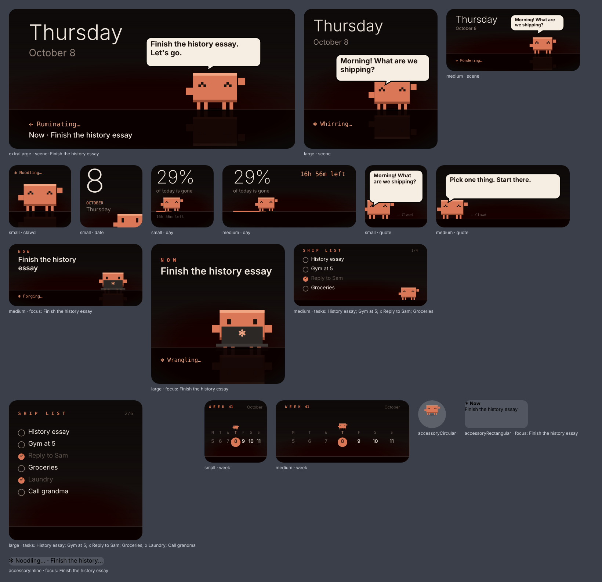
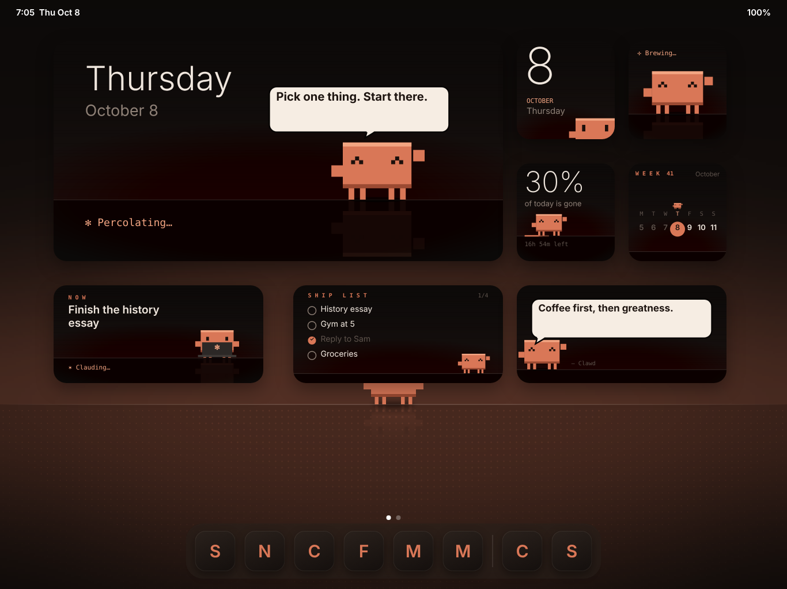
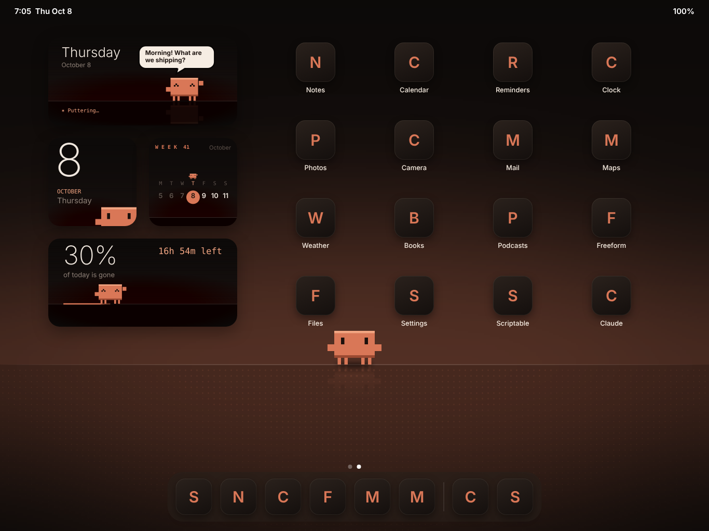

# Clawd Island

A minimalist, full-screen "living wallpaper" for your iPad, starring Clawd. There are no widgets. The whole screen is one calm scene:

- **A liquid Dynamic Island** at the top. It shows the time, and while a timer runs it splits off a bubble with a progress ring. It also pops open with alerts (focus started, task shipped, break over). Tap it to expand into a Live Activity with Pause, +5 min, Skip, and Ship task.
- **A large thin clock** with the date and a Claude status line underneath (`✻ Pondering… · your current task`).
- **Clawd on the horizon.** Clawd wanders across the screen, thinks out loud with Claude's spinner and verbs, and talks in comic speech bubbles. In focus mode Clawd types on a laptop, on breaks Clawd sips coffee, and after a few idle minutes Clawd falls asleep. Shipping a task sets off a "SHIPPED!" burst. Tap Clawd to say hi.
- **The horizon line is the timer.** It fills with orange during focus and green during breaks. The glow behind it changes with the time of day.
- **Tasks & timer live in a sheet.** Tap the status line or the "Tasks & timer" button to slide it up; swipe down or tap outside to close it.
- **Corner buttons fade away** after a few seconds untouched, so it stays clean on your desk. Touch the screen to bring them back.

Everything (tasks, timer, today's stats) is saved on the device. There is no account and no server.

## Put it on your iPad

1. Host the folder anywhere static. The easiest option is **GitHub Pages**: in the repo, go to *Settings → Pages → Deploy from branch*, then pick the branch and `/ (root)`.
2. Open the Pages URL in **Safari** on the iPad.
3. Tap **Share → Add to Home Screen**. Launching from the icon opens it full screen with no browser bars, and it works offline after the first load.
4. Turn on the ☀︎ keep-awake button (top right) so it can sit on your desk like a clock.

> iPadOS doesn't let apps or websites draw over other apps, so the island lives inside this app, not across the whole system.

## Home Screen & Lock Screen widgets

Web apps can't make iPad widgets, so the widgets use **Scriptable**, a free app that turns a script into native widgets.
One script makes every version; you pick which one in the widget's **Parameter**.

| Parameter | What it shows | Best sizes |
| --- | --- | --- |
| `scene` (or `scene: your task`) | Clawd on the horizon with a speech bubble | medium, large, extra large |
| `clawd` | Just Clawd; mood follows the clock | small |
| `date` | Big date, Clawd peeking up from the bottom | small |
| `day` | How much of today is gone; Clawd walks along it | small, medium |
| `quote` (or `quote: your text`) | A comic speech bubble from Clawd | small, medium |
| `focus: your task` | Your one task right now; Clawd at the laptop | medium, large |
| `tasks: A; B; x C` | Ship list (start an item with `x ` to tick it) | medium, large |
| `week` | This week with today marked | small, medium |

Leaving Parameter empty gives `clawd` on small widgets and `scene` on the others. Widgets refresh about every 15 minutes; tapping one opens the app.

**Set up**
1. Install **Scriptable** from the App Store (free).
2. In Safari, open [`widget/clawd-widget.js`](https://raw.githubusercontent.com/SGBOI/Dynamic-Island/claude/clawd-island/widget/clawd-widget.js), select all, and copy.
3. In Scriptable, tap **+**, paste, and rename the script **Clawd**.
4. On the Home Screen, long-press → **Edit** → **Add Widget** → **Scriptable**, pick a size, add it.
5. Long-press the widget → **Edit Widget** → Script: **Clawd**, Parameter: one of the words above.

Lock Screen: long-press the Lock Screen → **Customize** → **Lock Screen** → widget area → **Scriptable**, then pick Clawd.

## Wallpapers

Square 2732×2732 images, so they fit an iPad in both orientations. In Safari, open one, long-press → **Save to Photos**, then Settings → **Wallpaper** → **Add New Wallpaper** → Photos.

- [`clawd-horizon.png`](wallpapers/clawd-horizon.png): Clawd standing on the warm horizon
- [`empty-horizon.png`](wallpapers/empty-horizon.png): the same glow with no Clawd, calmest behind a busy page
- [`clawd-night.png`](wallpapers/clawd-night.png): cool night version with Claude sparks and a sleeping Clawd

## Suggested two-page layout (landscape)

**Page 1, widgets only:** extra large `scene` · small `date`, `clawd`, `day`, `week` · medium `focus`, `tasks`, `quote`

**Page 2, widgets and apps:** medium `scene` · small `date`, `week` · medium `day` · your apps on the right

To make app icons match: long-press the Home Screen → **Edit** → **Customize** → **Tinted**, and pick an orange close to Clawd's.

## Files

- `index.html`: the whole app (HTML, CSS, JS, and Clawd drawn as pixel-art SVG)
- `manifest.webmanifest`, `sw.js`, `icons/`: Home Screen install and offline support
- `widget/clawd-widget.js`: the Scriptable widgets
- `wallpapers/`: wallpapers and layout mockups
